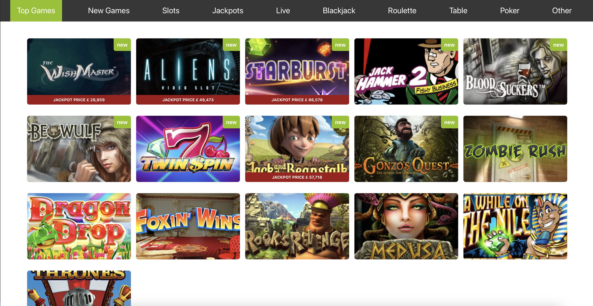

# Casino Test App

- Run `npm start` to run the project.
- I like to host it in Vercel but it's not setup for CORS due to time

## App Preview

## Notes

- Jackpot prices refreshes every 10 seconds
- Ribbon design is just CSS
- Using plain CSS and simple react project (using a framework might be overkill)
- Created animation when hovering (doesn't do anything)
- Navbar are based on the games categories. Thus, Table, & Live are empty.
- Jackpots menu shows all games with jackpots.
- Created partial unit tests

- Run `npm test` for the unit tests
